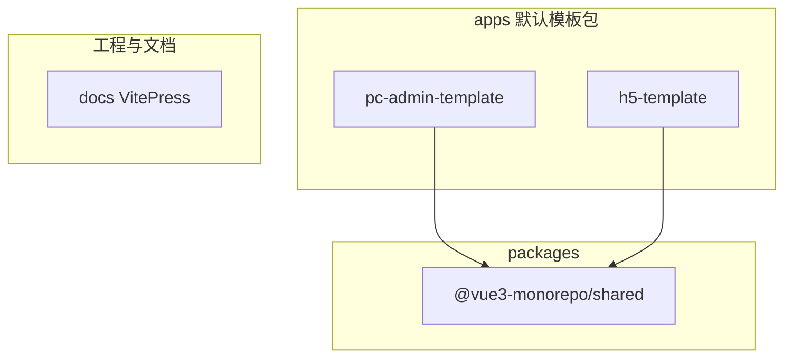

# 架构说明

本文以 **PC 管理端模板**（`apps/pc/pc-admin-template`）为主描述启动、路由、HTTP 等实现，便于对照目录结构；若你的工程由 `pnpm run create-app` 生成，**结构相同**，请将路径替换为实际应用目录。H5 在结构类似处会注明差异。更上层的**仓库与包边界**见下节。

## Monorepo 仓库级视图



> 图中为**开箱默认**的两条模板包；**业务开发**请在 `create-app` 生成的应用目录中进行（见 [项目与目录约定](./project-conventions.md)）。还可在 `apps/pc/*`、`apps/h5/*` 下通过 `pnpm run create-app` 增加更多独立工程，均依赖 `shared`，并各自占用独立 dev 端口（见 [新增 H5 / Admin 应用](./adding-a-new-app.md)）。

| 单元                        | 职责                                                                                                                    |
| --------------------------- | ----------------------------------------------------------------------------------------------------------------------- |
| `apps/pc/pc-admin-template` | PC **模板**（`create-app` 蓝本）：Element Plus、动态路由与权限、Mock；业务代码写在生成目录中                            |
| `apps/h5/h5-template`       | H5 **模板**（`create-app` 蓝本）：Vant、Bridge、移动端适配；业务代码写在生成目录中                                      |
| `packages/shared`           | 跨端复用：类型、工具、`request-core` / `request-pc` / `request-h5`、hooks、分端组件与指令等；**不**承载业务强耦合 store |
| `docs`                      | 本文档站 `pnpm run docs:dev` / `docs:build`                                                                             |
| 根 `package.json` 脚本      | 聚合 `typecheck` / `lint` / `test` / `build` / `verify:full` 等                                                         |

**构建顺序**（根 `pnpm run build`）：默认 `admin:build` → `h5:build` → `docs:build`。若在 `create-app` 时勾选将新应用写入根 `build` 链，或手工改过根 `package.json` 的 `build` 字段，**以当前仓库内脚本为准**。新代码与目录放哪见 [项目与目录约定](./project-conventions.md)。

## 技术栈

版本以仓库根目录 `package.json` 为准，以下为当前主要依赖（节选）：

| 分类     | 技术                                       | 版本              |
| -------- | ------------------------------------------ | ----------------- |
| 框架     | Vue 3 (Composition API)                    | ^3.4.31           |
| 构建     | Vite                                       | ^5.3.3            |
| 语言     | TypeScript（`tsconfig` 中 `strict: true`） | ^5.5.3            |
| UI       | Element Plus                               | ^2.7.6            |
| 状态管理 | Pinia + pinia-plugin-persistedstate        | ^2.1 / ^3.2       |
| 路由     | Vue Router                                 | ^4.3.3            |
| HTTP     | Axios（`src/utils/http` 封装）             | ^1.7.2            |
| 国际化   | Vue I18n（`src/locales`）                  | ^9.14.4           |
| 监控     | Sentry                                     | 见 package.json   |
| 工具     | VueUse、Lodash-ES、Day.js 等               | 见 `dependencies` |

## 启动流程

与 `src/main.ts` 中 `bootstrap()` 一致（Element Plus 与全局样式在 `bootstrap` 之前通过 `import` 注入）：

```
bootstrap()
  1. setupStore(app)           # Pinia + persistedstate 插件
  2. registerDirectives(app)   # v-permission / v-role
  3. app.use(router)           # 先注册路由（Sentry 等需 router）
  4. setupPlugins(app, router) # 顺序：ErrorHandler → Element Plus → I18n → Sentry（无 DSN 则跳过）
  5. await router.isReady()
  6. app.mount('#app')
```

## 路由体系

### 静态路由（`router/index.ts`）

- 登录、注册、忘记密码、403、Layout（含子路由 `home`、嵌套 `examples`：crud / form / upload / charts 等）、404 兜底
- 需登录的页面也可配置 `meta.permissions`（如首页 `dashboard:view`）

### 动态路由（`stores/modules/permission.ts`）

- 登录后调用 `GET /menu/routes` 获取后端菜单
- `menuToRoutes()` 将菜单转为 Vue Router 路由对象
- `addRoute('Layout', route)` 挂载到 Layout 子路由下
- 路由组件通过 `import.meta.glob('../../views/**/*.vue')` 懒加载

### 路由守卫（`router/guards.ts`）

```
beforeEach（含 NProgress）:
  无 token：白名单 /login、/register、/forgot-password 或 requiresAuth === false 放行，否则去登录
  有 token 访问 /login：重定向 /
  有 token 但无 userInfo：fetchUserInfo，失败则登出
  动态路由未加载：generateRoutes 后对每段 router.addRoute('Layout', route)，并 replace 重匹配
  已加载：仅合并 meta.permissions 做 hasPermission 校验，不通过 → /403
  （RouteMeta.roles 已声明，当前守卫不校验；角色请用 v-role / usePermission().hasRole()）
afterEach: document.title、tabsStore.addTab、NProgress.done
```

## 状态管理

| Store        | 职责                          |
| ------------ | ----------------------------- |
| `app`        | 主题/语言/侧边栏/页面加载状态 |
| `user`       | 登录/用户信息/token/权限/角色 |
| `permission` | 菜单/动态路由/路由加载状态    |
| `tabs`       | 标签页列表/当前 Tab 操作      |

## HTTP 层（`utils/http/`）

```
HttpRequest 类
  ├─ pendingRequests: Map<key, AbortController>   # 请求取消池
  ├─ 请求拦截
  │   ├─ cancelDuplicate → 取消旧请求，注册新 AbortController
  │   ├─ showLoading → 全局 Loading
  │   └─ withToken → 注入 Authorization header
  └─ 响应拦截
      ├─ 成功 → 移出请求池，校验业务 code
      └─ 失败 → 移出请求池 / 取消静默 / 401 自动刷新 / 重试
```

**请求取消用法：**

```ts
// 防重复请求
http.get('/search', { keyword }, { cancelDuplicate: true })

// 页面离开时取消所有请求
import { cancelAllRequests } from '@/utils/http'
onUnmounted(cancelAllRequests)
```

## 权限体系

```
后端菜单 → 动态路由（页面级）
用户 permissions[] → v-permission 指令 / hasPermission()（按钮级）
用户 roles[]       → v-role 指令 / hasRole()（角色级）
```

## 主题体系

- CSS 自定义属性（`:root` / `html.dark`）驱动
- `useAppStore().setTheme('light' | 'dark' | 'system')` 切换；`system` 监听 `prefers-color-scheme`
- Element Plus `theme-chalk/dark/css-vars.css` 在 `main.ts` 中于主样式前引入
- `variables.scss` 经 Vite `additionalData` 注入各 SCSS；`index.scss` 含 reset、dark 覆盖与工具类

## 异常处理

| 层级                     | 处理方式                                        |
| ------------------------ | ----------------------------------------------- |
| HTTP 错误                | Axios 响应拦截 + ElMessage                      |
| Vue 组件错误（可降级）   | ErrorBoundary 组件                              |
| Vue 组件错误（全局兜底） | `app.config.errorHandler`                       |
| 全局 JS 错误             | `window.onerror`                                |
| 未捕获 Promise           | `window.addEventListener('unhandledrejection')` |

## 构建优化

- **分包**：element-plus / vue-vendor / vue-i18n / utils 独立 chunk
- **压缩**：Gzip + Brotli 双格式（nginx 预读压缩文件）
- **懒加载**：所有页面路由组件均为动态导入
- **按需加载**：在页面/组件内显式 `import` Element Plus 与 `@element-plus/icons-vue`；Vite `manualChunks` 将 `element-plus` 等打入独立 chunk
